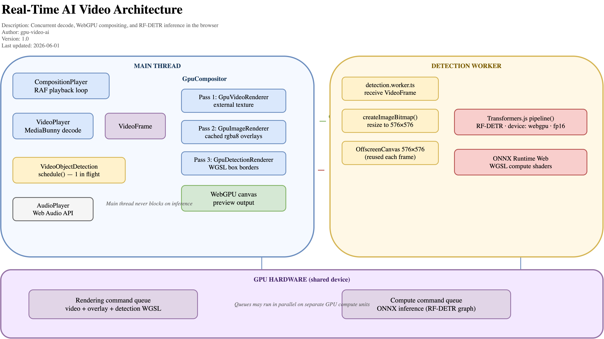
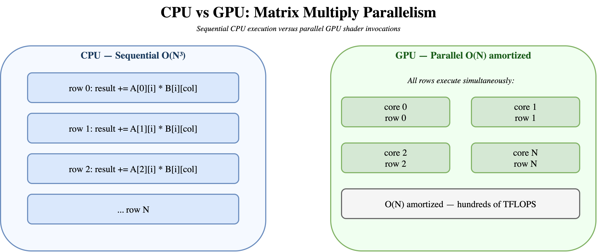
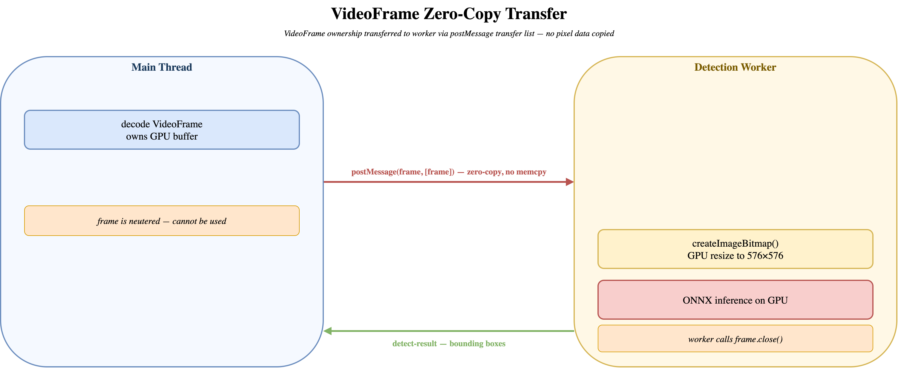
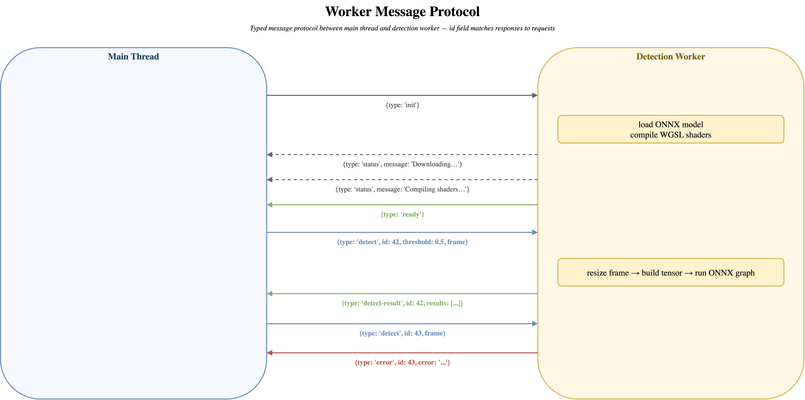
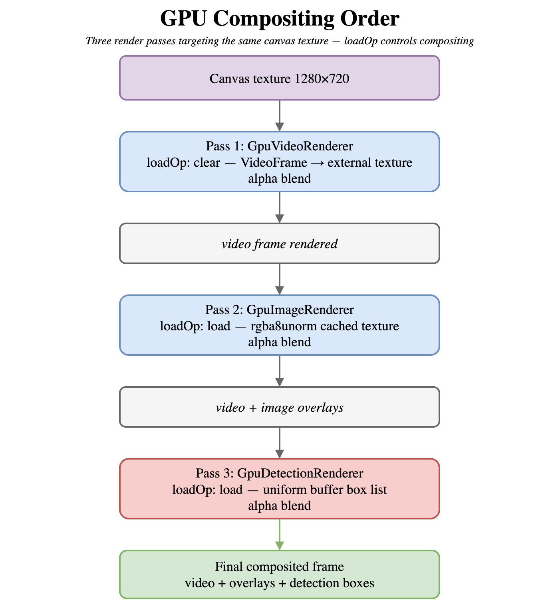

# Part 3: WebGPU + AI Vision in the Browser: Real-Time Object Detection on the Browser

In [Part 2: Hardware-Accelerated Video Processing](https://github.com/apssouza22/webgpu-video-ai/blob/main/ARTICLE.md) we built a complete encode/decode pipeline: MediaBunny decoded video frames, WebGPU composited layers, and WebCodecs exported a final MP4 — all without a server. That pipeline processed video offline, one frame at a time, as fast as the CPU allowed.

Part 3 adds a harder constraint: **real-time**. We want to run an AI object detection model on every video frame as it plays and draw bounding boxes on the GPU — without ever stalling the video. That means three things must happen concurrently: decoding, inference, and rendering. This article explains the architecture that makes that possible and why each piece of the stack was chosen.


> **Live demo:** [apssouza22.github.io/webgpu-video-ai](https://apssouza22.github.io/webgpu-video-ai) — open it in Chrome or Edge with a GPU, no install required.
> **Source code:** [github.com/apssouza22/webgpu-video-ai](https://github.com/apssouza22/webgpu-video-ai)


## Why AI in the browser?

Running models in the browser used to mean a Python server, a REST API, and a round-trip that made real-time interaction impractical. Three recent additions change that:

- **WebGPU** exposes the GPU's thousands of cores directly to web code, making matrix math fast enough for neural networks.
- **ONNX Runtime Web** compiles a standard model format to run on that GPU from JavaScript.
- **Transformers.js** wraps ONNX Runtime with a Hugging Face–compatible API, so loading a model is one `pipeline()` call.

Together they let you download a model once to the browser cache and run inference locally, frame after frame, with no server. You can see this running right now at the [live demo](https://apssouza22.github.io/webgpu-video-ai) — the model downloads on first load, then detects objects in the video entirely on your local GPU.


## System architecture overview

Before diving into each component, here is how all the pieces fit together. Three execution contexts run concurrently and communicate through a small set of typed messages and GPU command queues:



*Source: [realtime-ai-architecture.drawio](./assets/diagrams/realtime-ai-architecture.drawio)*

The main thread never blocks on inference. The GPU hardware executes both rendering and inference command buffers, potentially in parallel on separate compute units.


## WebGPU: why it matters for AI

Graphics and AI share a fundamental operation: multiply a large matrix by a vector, millions of times per second. A CPU executes these sequentially, one element at a time. A GPU executes them in parallel across thousands of shader invocations that all run simultaneously.



*Source: [cpu-vs-gpu.drawio](./assets/diagrams/cpu-vs-gpu.drawio)*

The difference is not incremental. A modern GPU can sustain hundreds of TFLOPS on matrix operations while a CPU manages a few TFLOPS at best. For a neural network, every layer is a matrix multiply. More parallelism means more layers per second, which means more frames per second.

WebGPU exposes this hardware through a low-overhead command model. Instead of issuing GPU calls one by one, you record a `GPUCommandEncoder`, accumulate all operations into it, and submit the whole batch in a single call:

```typescript
const encoder = this.device.createCommandEncoder();
const pass = encoder.beginRenderPass({ ... });
pass.setPipeline(this.pipeline);
pass.setBindGroup(0, bindGroup);
pass.draw(6);
pass.end();
this.device.queue.submit([encoder.finish()]);
```

The GPU processes the command buffer asynchronously. The CPU continues without waiting. This is the design that makes it possible to both render video and run AI inference at the same time.

### Comparison with WebGL

WebGL was designed for rendering, not compute. Doing matrix math in WebGL requires abusing fragment shaders — packing data into textures and writing shaders that treat each pixel as a matrix element. It works, but it is awkward, limited in precision, and cannot express modern network architectures cleanly.

WebGPU adds a dedicated **compute shader** stage (`@compute`). ONNX Runtime Web uses compute shaders for every operation in a neural network: matrix multiplication, convolution, attention, normalization. The shader code is written in WGSL, the same language used for rendering, and runs on the same hardware. The AI pipeline and the rendering pipeline live in the same GPU process, sharing the same device and queue.


## Transformers.js and ONNX: how they work

### ONNX: a universal model format

ONNX (Open Neural Network Exchange) is a file format that describes a model as a computation graph. Nodes are operations (matrix multiply, ReLU, softmax), and edges are tensors that flow between them.

Training frameworks — PyTorch, TensorFlow, JAX — can all export to ONNX. ONNX Runtime then runs that graph on any supported backend: CPU, CUDA, CoreML, or **WebGPU**. When loaded in the browser, ONNX Runtime Web reads the graph, allocates GPU buffers for each tensor, and compiles the operations into WGSL shaders at load time — which is why the first inference ("warmup") always takes longer than subsequent ones.

The model used here, `onnx-community/rfdetr_medium-ONNX`, is a real-time detection transformer. It takes a `576×576` image as input and returns bounding boxes with class labels and confidence scores. The ONNX file is hosted on Hugging Face and downloaded into the browser's cache the first time you load the [demo](https://apssouza22.github.io/webgpu-video-ai).

### Transformers.js: pipeline abstraction

Transformers.js wraps ONNX Runtime Web with a high-level API modeled after the Hugging Face `transformers` Python library. In [`detection.worker.ts`](https://github.com/apssouza22/webgpu-video-ai/blob/main/src/detection/detection.worker.ts), loading the model is a single call:

```typescript
const MODEL_ID = 'onnx-community/rfdetr_medium-ONNX';

detector = await pipeline('object-detection', MODEL_ID, {
  device: 'webgpu',   // compile ONNX graph to WGSL compute shaders
  dtype: 'fp16',      // faster WebGPU inference (fp32 is more accurate)
  progress_callback: (progress) => {
    // streams download progress: file name + percentage
    post({ type: 'status', message: `Downloading ${progress.file} (${percent}%)…` });
  },
});
```

`device: 'webgpu'` tells Transformers.js to compile the ONNX graph onto the GPU via WebGPU. The `progress_callback` is useful because the model is tens of megabytes: you can display a real download bar rather than a silent spinner — which is exactly what the [demo](https://apssouza22.github.io/webgpu-video-ai) shows in the status area during first load.

After the `await` resolves, `detector` is a callable function. You pass it an image (here an `OffscreenCanvas`) and get back structured results:

```typescript
const results = await detect(canvas, { threshold: 0.5, percentage: true });
// [{ label: 'person', score: 0.91, box: { xmin: 0.12, ymin: 0.08, xmax: 0.44, ymax: 0.97 } }, ...]
```

`percentage: true` returns box coordinates normalized to 0–1, which matches the coordinate system the WebGPU detection shader uses directly — no conversion needed.


## The parallel processing problem

Here is the core tension. Video at 30 fps gives you 33 ms per frame. Inference alone exceeds that budget on most hardware:

RF-DETR on a mid-range GPU takes 30–80 ms. If inference ran synchronously on the main thread, the video would stutter every single frame.

The key insight is that inference and rendering **do not need to happen in the same frame**. The detections from frame N are still valid for frames N+1 and N+2 — objects do not teleport. You can display slightly stale boxes and refresh them as new inference results arrive asynchronously. That observation unlocks the architecture.


## Web Workers: the isolation layer

A Web Worker is a JavaScript execution context that runs on a separate OS thread. It shares no memory with the main thread, has its own event loop, and cannot access the DOM. What it *can* access: WebGPU, `OffscreenCanvas`, `VideoFrame`, and `fetch`.

Isolating the model inside a Worker gives you three critical properties:

**1. The main thread is never blocked.** Model loading, WGSL shader compilation, and inference all happen on the worker thread. The `requestAnimationFrame` loop that drives video playback continues at 60 fps regardless of what the model is doing.

**2. The GPU is shared.** Both the worker's WebGPU inference pipeline and the main thread's rendering pipeline target the same physical GPU. They share no JavaScript objects, but the hardware executes their command buffers concurrently when possible.

**3. `VideoFrame` transfer is zero-copy.** `VideoFrame` is a transferable object. When you pass it in the `postMessage` transfer list, the underlying GPU texture buffer moves to the worker without copying pixel data:



*Source: [videoframe-transfer.drawio](./assets/diagrams/videoframe-transfer.drawio)*

A 1280×720 frame at 4 bytes per pixel is 3.5 MB. Copying that on every frame would add ~100 MB/s of memory bandwidth overhead — the zero-copy transfer makes the overhead negligible:

```typescript
// ObjectDetector.ts — main thread
this.worker.postMessage(
  { type: 'detect', id, threshold, frame },
  [frame],   // ← transfer list: frame is moved, not copied
);
// frame is now null/neutered on the main thread
```

### The typed message protocol

The worker communicates through a narrow, explicitly typed protocol defined in [`workerMessages.ts`](https://github.com/apssouza22/webgpu-video-ai/blob/main/src/detection/workerMessages.ts):



*Source: [worker-protocol.drawio](./assets/diagrams/worker-protocol.drawio)*

The numeric `id` field is essential: it matches each response to its originating request. The `ObjectDetector` class on the main thread stores pending promises in a `Map<id, {resolve, reject}>`:

```typescript
// ObjectDetector.ts
async detect(frame: VideoFrame, options: { threshold: number }): Promise<DetectionResult[]> {
  const id = this.nextId++;
  return new Promise((resolve, reject) => {
    this.pending.set(id, { resolve, reject });
    this.worker.postMessage({ type: 'detect', id, threshold: options.threshold, frame }, [frame]);
  });
}

// on 'detect-result' message:
const pending = this.pending.get(message.id);
pending?.resolve(message.results);
this.pending.delete(message.id);
```

This is a clean bridge from a message-passing interface to async/await without a library.


## The detection pipeline end to end

### Step 1 — Frame preprocessing inside the worker

RF-DETR expects a `576×576` image. Video frames are typically `1280×720` or larger. The worker resizes the transferred `VideoFrame` using `createImageBitmap` with explicit resize parameters, then draws it onto a persistent `OffscreenCanvas`:

```typescript
// detection.worker.ts
const MODEL_INPUT_SIZE = 576;

async function runDetection(frame: VideoFrame, threshold: number) {
  const { canvas, ctx } = getPreprocessSurface(); // reused 576×576 OffscreenCanvas

  const bitmap = await createImageBitmap(frame, {
    resizeWidth: MODEL_INPUT_SIZE,
    resizeHeight: MODEL_INPUT_SIZE,   // GPU-accelerated resize
  });
  ctx.drawImage(bitmap, 0, 0);
  bitmap.close();
  frame.close(); // release the transferred VideoFrame

  return detect(canvas, { threshold, percentage: true });
}
```

`createImageBitmap` with resize parameters is GPU-accelerated in browsers that support it. The `OffscreenCanvas` is created once with `{ willReadFrequently: true }` so the browser optimizes its backing store for the one CPU readback that Transformers.js needs to build the input tensor.

### Step 2 — Throttling: one frame in flight

Running inference takes longer than a single video frame. The `VideoObjectDetection` class in [`VideoObjectDetection.ts`](https://github.com/apssouza22/webgpu-video-ai/blob/main/src/player/VideoObjectDetection.ts) implements a simple but effective throttle: if a detection is already running, the incoming frame is held as a "pending" replacement. When inference completes, it immediately starts on the pending frame, dropping any intermediate frames:

```typescript
schedule(videoFrame: VideoFrame): void {
  if (this.detectionBusy) {
    this.pendingDetectionFrame?.close();            // discard previous pending
    this.pendingDetectionFrame = new VideoFrame(videoFrame);
    return;
  }
  void this.runDetection(new VideoFrame(videoFrame));
}
```

At any given moment there is at most one detection in flight and one pending. The detection rate tracks hardware capability automatically — a fast GPU detects every frame, a slow GPU skips frames without any explicit rate-limiting code.

### Step 3 — Version-gating stale results

There is a subtle race: between submitting a detection and receiving the result, the user might seek to a different position in the video. Applying old bounding boxes to new content looks wrong. An incrementing version counter handles this:

```typescript
private async runDetection(detectionFrame: VideoFrame): Promise<void> {
  const detectionVersion = ++this.detectionVersion;
  // ...inference (may take 50ms)...
  if (detectionVersion !== this.detectionVersion) {
    return; // a newer detection was started — discard this result
  }
  this.detections = toGpuDetections(results);
}
```

Every call to `runDetection` increments the counter. On completion, it checks that the counter has not moved. If it has, the stale result is silently dropped.


## Rendering detections on the GPU

The bounding boxes returned by the model are JavaScript objects. To draw them without looping over pixels in JavaScript, they are packed into a WebGPU uniform buffer and sent to a WGSL shader that draws the boxes entirely on the GPU.

### The uniform buffer layout

```
Offset 0  ┌─────────────────────────────────┐
          │  count    (u32,  4 bytes)        │
Offset 4  │  lineWidth (f32, 4 bytes)        │
Offset 8  │  _pad      (vec2f, 8 bytes)      │
Offset 16 ├─────────────────────────────────┤  ← boxes start
          │  box[0].bounds (vec4f, 16 bytes) │  xmin, ymin, xmax, ymax
          │  box[0].color  (vec4f, 16 bytes) │  r, g, b, alpha
Offset 48 ├─────────────────────────────────┤
          │  box[1].bounds (16 bytes)        │
          │  box[1].color  (16 bytes)        │
          ├─────────────────────────────────┤
          │  ...                             │
          │  box[31]                         │
Offset 1040└─────────────────────────────────┘
Total: 16 + 32 × 32 = 1,040 bytes (fixed, allocated once at startup)
```

Fixed at 32 boxes maximum — enough for any real scene, and the constant size means the buffer is allocated once at startup and reused every frame with a single `writeBuffer` call.

### The fragment shader draws borders analytically

Instead of uploading one quad per bounding box (which would require a dynamic vertex buffer), the shader uses a **full-screen triangle pass** and tests each pixel analytically against all boxes in the uniform buffer:

```wgsl
fn onBorder(uv: vec2f, bounds: vec4f, lineWidth: f32) -> bool {
  let insideX = step(bounds.x, uv.x) * step(uv.x, bounds.z);
  let insideY = step(bounds.y, uv.y) * step(uv.y, bounds.w);

  let nearLeft   = abs(uv.x - bounds.x) < lineWidth;
  let nearRight  = abs(uv.x - bounds.z) < lineWidth;
  let nearTop    = abs(uv.y - bounds.y) < lineWidth;
  let nearBottom = abs(uv.y - bounds.w) < lineWidth;

  return (nearLeft  && insideY > 0.5) ||
         (nearRight && insideY > 0.5) ||
         (nearTop   && insideX > 0.5) ||
         (nearBottom && insideX > 0.5);
}

@fragment
fn fragmentMain(input: VertexOutput) -> @location(0) vec4f {
  var color = vec4f(0.0);  // transparent by default
  for (var i = 0u; i < detection.count; i++) {
    let box = detection.boxes[i];
    if (onBorder(input.uv, box.bounds, detection.lineWidth)) {
      color = vec4f(box.color.rgb, 1.0);
    }
  }
  return color;
}
```

Every fragment (pixel) independently tests whether it falls on the border of any detection box. The GPU runs these tests in parallel across all pixels simultaneously — ~921,600 pixels × 5 box tests = ~4.6M comparisons completed in a single render pass in under 1ms. No geometry uploads, no dynamic buffers, no JavaScript loops over pixels.

### The compositing order

The [`GpuCompositor`](https://github.com/apssouza22/webgpu-video-ai/blob/main/src/gpu/GpuCompositor.ts) issues three render passes per frame in a fixed order, all targeting the same canvas texture:



*Source: [compositing-order.drawio](./assets/diagrams/compositing-order.drawio)*

Each pass's `loadOp: 'load'` means "start from what the previous pass wrote." WebGPU serializes passes within a queue submission, so each pass sees the accumulated result of all prior passes. The detection layer always renders last, so boxes are always visible on top of any overlay.


## The warmup problem

ONNX Runtime Web compiles WGSL shaders for each operation in the model graph on first use. On a complex model like RF-DETR, this takes one to three seconds and produces a visible freeze if it happens during playback. The fix is one inference before the user presses play:

```typescript
// main.ts
setStatus('Warming up RF-DETR shaders (first inference)…');
await player.getVideoPlayer().warmupDetection(0);
```

This decodes frame 0, runs it through the full detection pipeline, and discards the result. The side effect is that all WGSL shaders are compiled and cached by the WebGPU driver. Every subsequent inference hits already-compiled pipelines and runs at steady-state speed. You can observe the warmup message in the status bar when you first open the [demo](https://apssouza22.github.io/webgpu-video-ai).


## Required HTTP headers

Transformers.js uses `SharedArrayBuffer` internally for efficient WASM memory management. `SharedArrayBuffer` is gated behind cross-origin isolation — the page must be served with:

```
Cross-Origin-Opener-Policy: same-origin
Cross-Origin-Embedder-Policy: require-corp
```

Without them, `SharedArrayBuffer` is unavailable and Transformers.js either falls back to a slower code path or fails outright. In Vite, these are set in the dev server configuration:

```typescript
// vite.config.ts
server: {
  headers: {
    'Cross-Origin-Opener-Policy': 'same-origin',
    'Cross-Origin-Embedder-Policy': 'require-corp',
  },
}
```

You must also set them in production. A missing COEP header is one of the most common reasons a Transformers.js app works in development but silently fails after deployment. Check them first when debugging.


## Key lessons

- **Transfer, do not copy.** `VideoFrame` is a transferable. Pass it with `[frame]` in the `postMessage` transfer list to move the GPU buffer to the worker with zero memory copy. Copying 3.5 MB of pixel data per frame destroys throughput.

- **Warm up before you need it.** ONNX shader compilation happens on first inference. Run one dummy call at startup — the [demo](https://apssouza22.github.io/webgpu-video-ai) does this before revealing the play button — so playback never triggers a compile stall mid-video.

- **One detection in flight.** Queuing detections faster than the model can process them causes memory pressure and bursty latency. A single pending-frame slot gives you the freshest possible result at any hardware speed, without any explicit rate-limiting.

- **Version-gate results.** Any async operation that feeds the render loop needs a staleness check. An incrementing counter is enough. Without it, seeking causes stale boxes to flash on screen.

- **Analyze pixels in the shader, not JavaScript.** Drawing bounding boxes as a full-screen analytical test is faster than uploading per-box geometry because the GPU runs the test across all pixels simultaneously with zero JavaScript overhead per pixel.

- **COEP/COOP are not optional.** Set them in both development and production. Check them first when debugging a Transformers.js deployment.


## What this architecture enables

The pipeline described here runs a 60-class object detector on live video at whatever rate the hardware supports — from a few detections per second on integrated graphics to near-frame-rate on a discrete GPU — without ever stalling video playback. You can see the detection FPS counter in the [live demo](https://apssouza22.github.io/webgpu-video-ai) updating in real time as the model runs.

More broadly, the same structure applies to any model you want to run on video: pose estimation, segmentation, depth prediction, face recognition. The worker isolation, the zero-copy transfer, the warmup, and the GPU rendering layer are all model-agnostic. Swap the Transformers.js `pipeline()` call and update the WGSL uniform struct, and the architecture carries the new task without structural changes.

The browser is no longer a thin client that sends video to a server for processing. It is a capable ML runtime with direct access to the GPU, a mature async concurrency model, and zero-copy primitives that make real-time inference practical. The gap between what you can build in the browser and what requires a backend is narrowing fast.

---

*Full source code: [github.com/apssouza22/webgpu-video-ai](https://github.com/apssouza22/webgpu-video-ai)*
*Live demo: [apssouza22.github.io/webgpu-video-ai](https://apssouza22.github.io/webgpu-video-ai)*